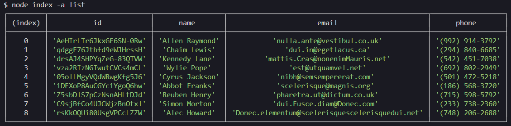
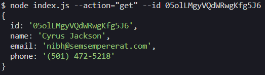
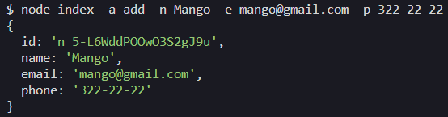
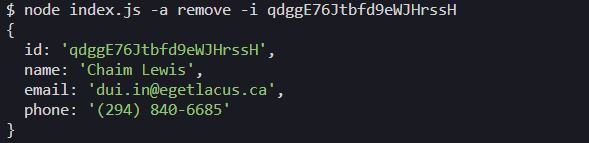
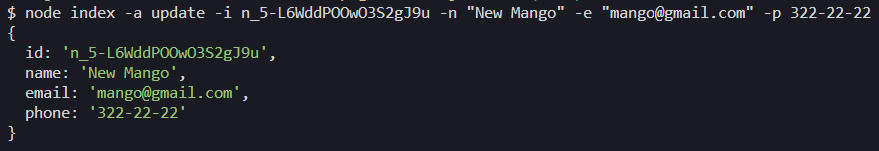

## Command execution

# Getting and displaying the list of contacts

node index -a list

 
https://ibb.co/2jkt8H6

# Get contact by id

node index -a get --id 05olLMgyVQdWRwgKfg5J6

 
https://ibb.co/6XjySf4

# Add contact

node index -a add -n Mango -e mango@gmail.com -p 322-22-22

 
https://ibb.co/LthZgs8

# Remove contact

node index -a remove -i qdggE76Jtbfd9eWJHrssH

 
https://ibb.co/C5X1xzp

# Update contact

node index -a update -i n_5-L6WddPOOwO3S2gJ9u -n "New Mango" -e "mango@gmail.com" -p 322-22-22

 
https://ibb.co/BzSTNmm
